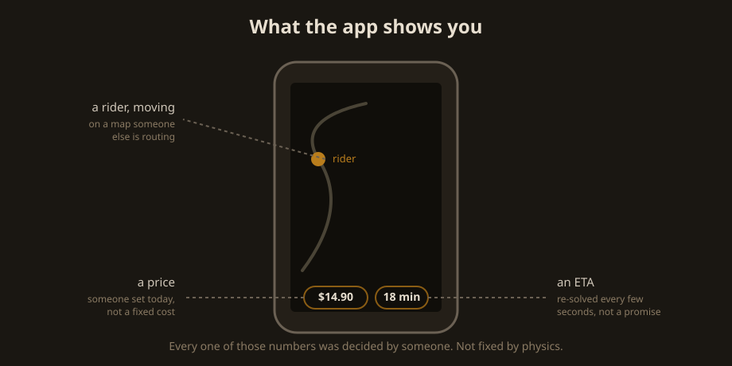
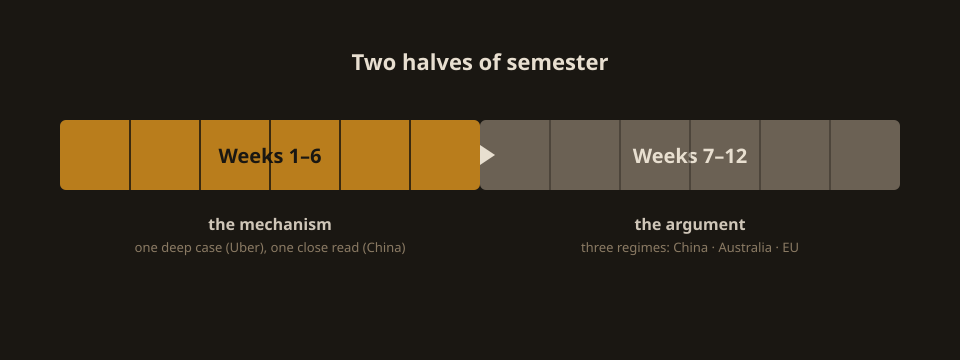
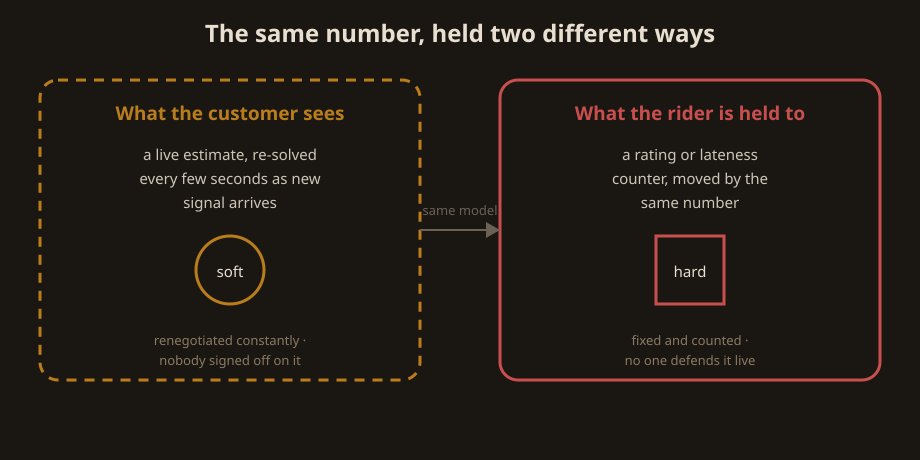

# The algorithm has a boss too

Week 1 · Trapped in the System


<small>Photo: Javier Perez Montes, CC BY-SA 4.0, via Wikimedia Commons</small>

```notes
Generic scene-setter (a Glovo rider in Madrid) — not tied to any platform
this course actually studies.
```

---

## An order, from the outside

You order food. The app shows:

- a price
- an ETA
- a rider, moving on a map

Every one of those numbers was decided by someone. Not fixed by physics.

---



---

## This course, in one line

This course is about who decided, and what it cost someone else.

---



---

## What you'll build toward

- **Ten weekly checkpoints** (wks 2–11) — small, specific, checked live
- **System up close** (wk 7) · **Same algorithm, different country** (wk 11)
- **Redesign the dispatch** (wk 12) — propose a mechanism, defend it

---

{/* _class: impact */}

# Now the actual topic: what "algorithmic management" means

---

## Where the term comes from

> Lee, Kusbit, Metsky & Dabbish (2015), *Working with Machines: The Impact
> of Algorithmic and Data-Driven Management on Human Workers*, CHI 2015

Software takes over decisions a human manager used to make: who does which
job, how it's rated, when someone is warned or let go. No robot boss
required — just the deciding moving from a person into a rule nobody in
the room can point to.

---

## The same number, held two different ways



---

## Why this course keeps returning to delivery

- almost the whole job — assignment, timing, rating — is decided by
  software before a human supervisor enters the picture
- a warehouse picker or call-centre agent usually still has a shift
  supervisor to appeal to; a bad call can be raised with a named person
  before it costs anything
- a delivery rider frequently does not: the app is the only interface,
  start to finish — the "appeal" is a support chatbot, or nothing
- that missing appeal step is not incidental to the case study — weeks
  8–10 are largely about whether the law can manufacture one

---

## The idea travelled

> Kellogg, Valentine & Christin (2020), *Algorithms at Work: The New
> Contested Terrain of Control*, Academy of Management Annals

From a description of gig platforms to a general theory of workplace
control — now cited in labour economics, organisational sociology, and
the regulatory determinations weeks 7–10 read closely.

---

{/* _class: quote */}

> An algorithm is not a rule from nowhere. It is a decision, laundered
> through code, made by someone who will never meet the person it falls
> on.

---

## Why "trapped in the system"

> Renwu (人物) magazine, 2020, "Delivery Riders, Trapped in the System"
> (外卖骑手，困在系统里) — later covered in English by Sixth Tone

This is the piece that gave the problem its name in Chinese public
discourse: "the rider, trapped in the system." Week 3 reads it closely,
alongside the coverage that carried it past a Chinese-language audience.

We will take that claim seriously enough to test it, not just repeat it.

---

## The claim we're testing

"The algorithm decided" can mean two very different things:

- an accurate description of a system too complex for anyone to have
  hand-specified the outcome
- a sentence that exists to make a paper trail stop at "the algorithm"

Telling the two apart is the actual skill — and the standard every essay
this semester is held to.

---

## Before week 2

Open a food-delivery app you don't already use. Add items to a cart, step
through checkout — no need to complete the order — and watch what the app
tells you about time and price, and what it doesn't.

That's the raw material for the dispatch lab.
